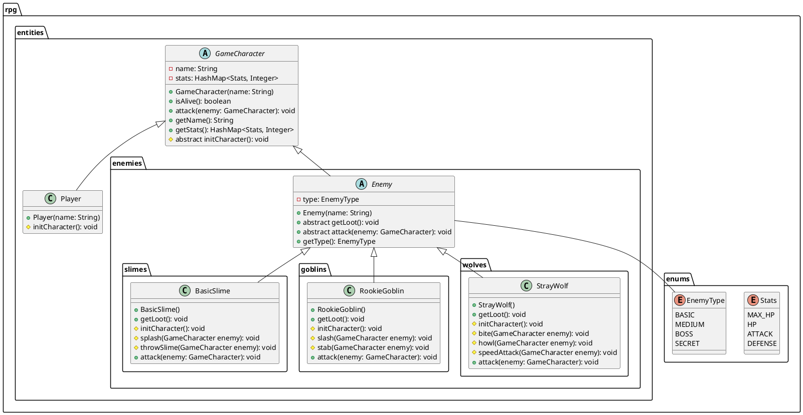

# 7. Las clases Abstractas y las Interfaces

Para efectos de nuestro proyecto, la clase `GameCharacter` es una clase abstracta que define un personaje de juego
genérico. La clase `GameCharacter` tiene un constructor que inicializa el nombre del personaje y un método abstracto
`attack` que debe ser implementado por las clases que heredan de `GameCharacter`.



```java
package rpg.entities;

import rpg.enums.Stats;

import java.util.HashMap;

public abstract class GameCharacter {

    protected String name;
    protected HashMap<Stats, Integer> stats;

    public GameCharacter(String name) {

        this.name = name;
        this.stats = new HashMap<>();
        initCharacter();
    }

    protected abstract void initCharacter();

    public boolean isAlive() {
        return stats.get(Stats.HP) > 0;
    }

    public void attack(GameCharacter enemy) {

        String message = "";
        String enemyName = enemy.getName();
        int damage = this.stats.get(Stats.ATTACK) 
                    - enemy.getStats().get(Stats.DEFENSE);
        int newHP = enemy.getStats().get(Stats.HP);
        if (damage > 0) {

            newHP = enemy.getStats().get(Stats.HP) - damage;
            enemy.getStats().put(Stats.HP, newHP);
            message += String.format("""
                    %s attacks %s for %d damage!
                    %s has %d HP left.
                    """, this.name, enemyName, damage, enemyName, newHP);
        } else {
            message += String.format("""
                    %s attacks %s but does no damage!
                    %s has %d HP left.
                    """, this.name, enemyName, enemyName, newHP);
        }
        System.out.println(message);
    }

    public String getName() {
        return name;
    }

    public HashMap<Stats, Integer> getStats() {
        return stats;
    }
}
```

En este ejemplo, la clase `GameCharacter` es una clase abstracta que define un método abstracto `initCharacter` que
debe ser implementado por las clases que heredan de `GameCharacter`. La clase `GameCharacter` también tiene un
constructor que inicializa el nombre del personaje y llama al método `initCharacter` para inicializar los atributos
del personaje.

## Implementación de una clase abstracta

```java
package rpg.entities;

import rpg.enums.Stats;

import java.util.HashMap;

public class Player extends GameCharacter {

    public Player(String name) {
        super(name);
    }

    @Override
    protected void initCharacter() {
        this.stats.put(Stats.MAX_HP, 100);
        this.stats.put(Stats.HP, 100);
        this.stats.put(Stats.ATTACK, 10);
        this.stats.put(Stats.DEFENSE, 5);
    }
}
```

## La palabra clave `super`

La palabra clave `super` se utiliza en Java para hacer referencia a la clase base de un objeto. En el contexto de la
herencia, `super` se utiliza para llamar a los métodos y constructores de la clase base desde la clase derivada.

## Resumen

En este ejemplo, la clase `Player` hereda de la clase `GameCharacter` y proporciona una implementación del método
`initCharacter`. La clase `Player` tiene un constructor que inicializa el nombre del jugador y llama al constructor
de la clase `GameCharacter` para inicializar el nombre del personaje y los atributos del jugador.

## Instanciación de una clase abstracta en otra clase Abstracta

```java
package rpg.entities.enemies;

import rpg.entities.GameCharacter;
import rpg.enums.Stats;

public abstract class Enemy extends GameCharacter {

    protected EnemyType type;

    public Enemy(String name) {
        super(name);
    }

    public abstract void getLoot();

    public abstract void attack(GameCharacter enemy);

    public EnemyType getType() {
        return type;
    }
}
```

En este ejemplo, la clase `Enemy` es una clase abstracta que hereda de la clase `GameCharacter` y define un método
abstracto `getLoot` y un método abstracto `attack`. La clase `Enemy` también tiene un atributo `type` que representa
el tipo de enemigo y un método `getType` que devuelve el tipo de enemigo.

## Implementación de una clase abstracta Enemy

```java
package rpg.entities.enemies.slimes;

import rpg.entities.GameCharacter;
import rpg.entities.enemies.Enemy;
import rpg.entities.enemies.EnemyType;
import rpg.enums.Stats;
import rpg.utils.Randomize;

public class BasicSlime extends Enemy {

    public BasicSlime() {
        super("Basic Slime");
    }

    @Override
    public void getLoot() {
        System.out.println("The Basic Slime drops a bottle of slime.");
    }

    @Override
    protected void initCharacter() {
        this.type = EnemyType.BASIC;
        this.stats.put(Stats.MAX_HP, 20);
        this.stats.put(Stats.HP, 20);
        this.stats.put(Stats.ATTACK, 4);
        this.stats.put(Stats.DEFENSE, 1);
    }

    protected void splash(GameCharacter enemy) {
        // Recuperamos el nombre del enemigo.
        String enemyName = enemy.getName();
        // Calculamos la vida del enemigo después del ataque. El daño es 0 en este caso.
        int newHP = enemy.getStats().get(Stats.HP);
        System.out.printf("""
                %s splashes %s and does nothing.
                %s has %d HP left.
                """, this.name, enemyName, enemyName, newHP);
    }

    protected void trhowSlime(GameCharacter enemy) {

        String enemyName = enemy.getName();
        int damage = (int) (this.stats.get(Stats.ATTACK) * 0.8);
        enemy.getStats().put(Stats.HP, 
                            enemy.getStats().get(Stats.HP) - damage);
        int newHP = enemy.getStats().get(Stats.HP);
        System.out.printf("""
                %s throws slime at %s for %d damage!
                %s has %d HP left.
                """, this.name, enemyName, damage, enemyName, newHP);
    }

    @Override
    public void attack(GameCharacter enemy) {

        if (Randomize.getRandomBoolean()) splash(enemy);
        else trhowSlime(enemy);
    }
}
```
