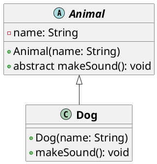

# Las clases abstractas

Una clase abstracta es una clase que no puede ser instanciada, es decir, no se pueden crear objetos de una clase
abstracta. Las clases abstractas se utilizan para definir una clase base que no tiene sentido por sí sola, pero que
puede ser extendida por otras clases. Las clases abstractas pueden contener métodos abstractos, que son métodos que no
tienen una implementación y deben ser implementados por las clases que heredan de la clase abstracta.

## Ejemplo de clase abstracta



```java
public abstract class Animal {

    protected String name;

    public Animal(String name) {
        this.name = name;
    }

    public abstract void makeSound();
}
```

En este ejemplo, la clase `Animal` es una clase abstracta que define un método abstracto `makeSound`. La clase `Animal`
también tiene un constructor que inicializa el nombre del animal. La clase `Animal` no puede ser instanciada, pero puede
ser extendida por otras clases que implementen el método `makeSound`.

## Implementación de una clase abstracta

```java
public class Dog extends Animal {

    public Dog(String name) {
        super(name);
    }

    @Override
    public void makeSound() {
        System.out.println("Guau guau!");
    }
}
```

En este ejemplo, la clase `Dog` hereda de la clase `Animal` y proporciona una implementación del método `makeSound`. La
clase `Dog` tiene un constructor que inicializa el nombre del perro y llama al constructor de la clase `Animal` para
inicializar el nombre del animal.

## Creación de una instancia de una clase abstracta

```java
Animal dog = new Dog("Fido");
dog.makeSound();
```

En este ejemplo, se crea una instancia de la clase `Dog` y se asigna a una referencia de tipo `Animal`. Cuando se llama
al método `makeSound` a través de la referencia de tipo `Animal`, se llama al método implementado en la clase `Dog`.

## Métodos abstractos

Un método abstracto es un método que no tiene una implementación y debe ser implementado por las clases que heredan de
la clase abstracta. Los métodos abstractos se definen con la palabra clave `abstract` y no tienen llaves `{}` después de
la firma del método.

## Ejemplo de método abstracto

```java
public abstract class Animal {

    protected String name;

    public Animal(String name) {
        this.name = name;
    }

    public abstract void makeSound();
}
```

En este ejemplo, el método `makeSound` es un método abstracto que no tiene una implementación. Las clases que heredan de
la clase `Animal` deben proporcionar una implementación del método `makeSound`.

## Reglas de las clases abstractas

Para definir una clase abstracta en Java, se deben seguir las siguientes reglas:

- La clase debe ser declarada con la palabra clave `abstract`.
- La clase puede contener métodos abstractos y métodos concretos.
- La clase no puede ser instanciada, es decir, no se pueden crear objetos de una clase abstracta.
- Las clases que heredan de la clase abstracta deben proporcionar implementaciones para los métodos abstractos.
- Las clases que heredan de la clase abstracta pueden ser instanciadas y utilizadas en el código.
- Las clases abstractas pueden heredar de otras clases abstractas o concretas.
- Las clases abstractas pueden tener constructores, campos y métodos como cualquier otra clase.
- Las clases abstractas pueden tener métodos estáticos y métodos finales.
- Las clases abstractas pueden tener métodos privados, pero no pueden ser abstractos.

Las clases abstractas son una herramienta poderosa en Java para definir una jerarquía de clases y proporcionar una
estructura común para las clases que heredan de la clase abstracta. Las clases abstractas permiten a los desarrolladores
definir métodos abstractos que deben ser implementados por las clases hijas, lo que garantiza una consistencia en la

## Conclusión

Las clases abstractas son una característica importante de la programación orientada a objetos en Java que permiten
definir una clase base que no puede ser instanciada, pero que puede ser extendida por otras clases. Las clases
abstractas pueden contener métodos abstractos que deben ser implementados por las clases hijas, lo que proporciona una
estructura común para las clases que heredan de la clase abstracta. Las clases abstractas son una herramienta poderosa
para definir jerarquías de clases y garantizar una consistencia en la implementación de métodos en las clases hijas.