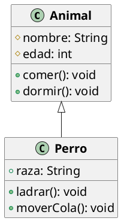

# Clases Base y Derivadas

Las clases base y derivadas son un concepto fundamental en la programación orientada a objetos. En este artículo,
exploraremos qué son las clases base y derivadas, cómo se relacionan entre sí y cómo se utilizan en la programación.

## Clases Base

Una clase base es una clase que se utiliza como plantilla para crear otras clases. También se conoce como clase
superior o clase padre. Las clases base contienen los miembros y métodos comunes que se comparten entre las clases
derivadas. Las clases base proporcionan una estructura común para las clases derivadas y definen las características
básicas que deben tener en común.

Por ejemplo, considera una clase base `Animal` que define las propiedades y métodos comunes a todos los animales. La
clase `Animal` puede tener propiedades como `nombre`, `edad` y métodos como `comer`, `dormir`. Las clases derivadas
como `Perro`, `Gato`, `Pájaro` pueden heredar de la clase base `Animal` y agregar sus propias propiedades y métodos
específicos.

## Clases Derivadas

Una clase derivada es una clase que se crea a partir de una clase base existente. También se conoce como clase hija o
subclase. Las clases derivadas heredan los miembros y métodos de la clase base y pueden agregar sus propios miembros y
métodos adicionales. Las clases derivadas extienden la funcionalidad de la clase base y pueden especializarse para
diferentes usos.

Por ejemplo, considera una clase derivada `Perro` que hereda de la clase base `Animal`. La clase `Perro` puede agregar
propiedades y métodos específicos como `raza`, `ladrar`, `moverCola` que son propios de los perros. La clase `Perro`
hereda los métodos comunes de la clase base `Animal` como `comer`, `dormir` y puede agregar su propia funcionalidad
específica.

## Relación entre Clases Base y Derivadas

La relación entre clases base y derivadas se conoce como herencia. La herencia permite que las clases derivadas
hereden los miembros y métodos de la clase base y extiendan su funcionalidad. La herencia es una forma de reutilización
de código que permite crear jerarquías de clases y organizar el código de manera más eficiente.

Por ejemplo, en el caso de las clases `Animal` y `Perro`, la clase `Perro` hereda los miembros y métodos de la clase
`Animal` y agrega su propia funcionalidad específica para los perros. La herencia permite definir una estructura común
para diferentes tipos de animales y especializarla para cada tipo específico.

## Diagrama de Clases

En un diagrama de clases, la relación de herencia entre una clase base y sus clases derivadas se representa mediante una
flecha con una punta de triángulo hueco que apunta desde la clase derivada a la clase base. La flecha indica que la
clase derivada hereda de la clase base y puede acceder a sus miembros y métodos.

Por ejemplo, en un diagrama de clases que muestra la relación entre la clase base `Animal` y la clase derivada `Perro`,
habría una flecha que apunta desde `Perro` a `Animal`, indicando que `Perro` hereda de `Animal`. Por lo que el diagrama
de clases se vería así:



En este diagrama, la clase `Perro` hereda de la clase `Animal`, lo que significa que `Perro` tiene acceso a los miembros
y métodos de `Animal` y puede agregar su propia funcionalidad específica.

Los clases en Java se pueden definir de la siguiente manera:

```java
public class Animal {
    protected String nombre;
    protected int edad;

    public void comer() {
        System.out.println("El animal está comiendo");
    }

    public void dormir() {
        System.out.println("El animal está durmiendo");
    }
}
```

```java
public class Perro extends Animal {
    private String raza;

    public void ladrar() {
        System.out.println("El perro está ladrando");
    }

    public void moverCola() {
        System.out.println("El perro está moviendo la cola");
    }
}
```

## Conclusiones

Las clases base y derivadas son un concepto fundamental en la programación orientada a objetos. Las clases base
proporcionan una estructura común para las clases derivadas y definen las características básicas que deben tener en
común. Las clases derivadas extienden la funcionalidad de la clase base y pueden especializarse para diferentes usos. La
herencia permite que las clases derivadas hereden los miembros y métodos de la clase base y extiendan su funcionalidad,
creando jerarquías de clases y organizando el código de manera más eficiente.