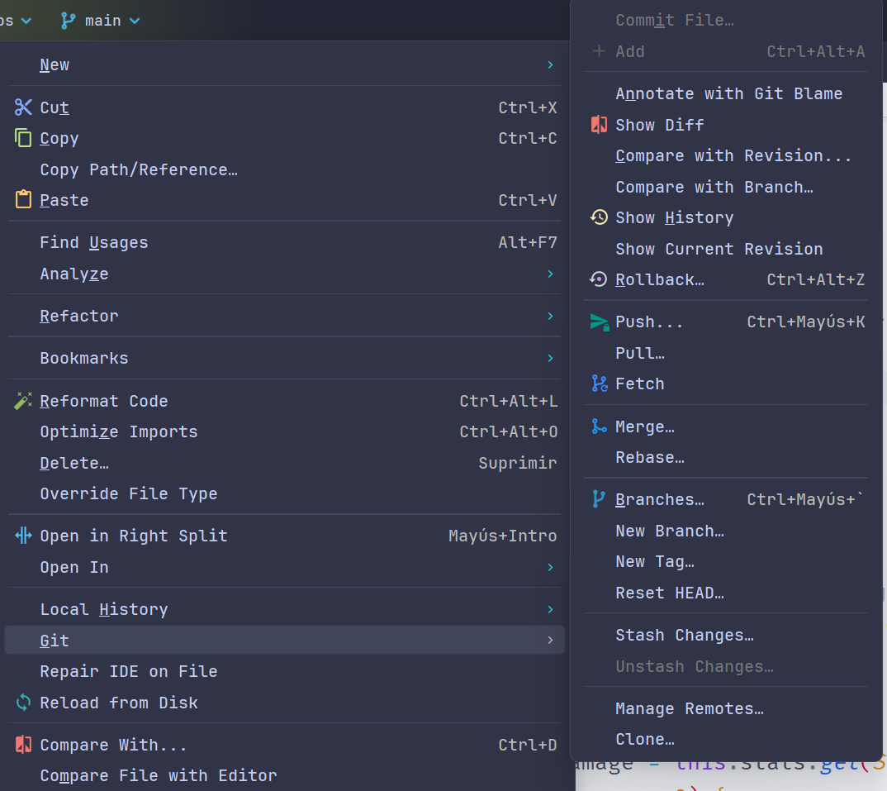
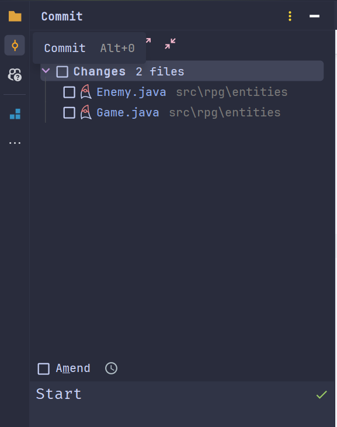
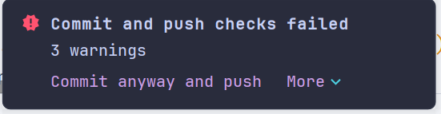
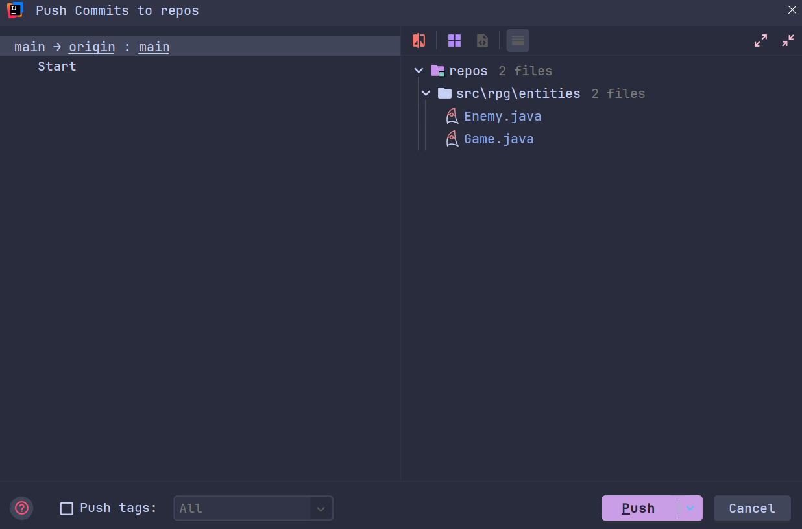
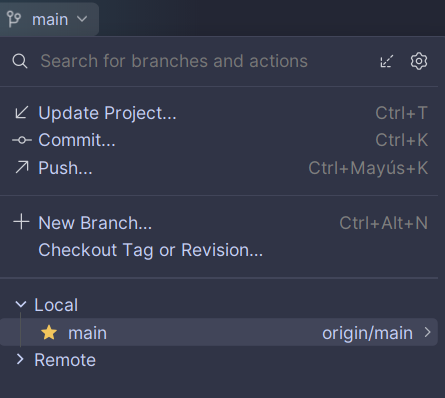

# Commit y Update de Archivos

## Commit

Para poder guardar los cambios que hemos realizado en un archivo, primero debemos de añadirlo al área de preparación.
Para ello en IntelliJ IDEA, podemos hacer clic derecho sobre el archivo y seleccionar la opción `Git -> Add`.

{style="block"}

Una vez que hemos añadido el archivo podemos ir a la pestaña `Commit` y escribir un mensaje que describa los cambios que
hemos realizado en el archivo. Posteriormente hacemos clic en el botón `Commit and Push`.

{style="block"}

> Es posible que si es la primera vez que usas el IDE para hacer esto, te solicite el nombre del usuario y el correo
> electrónico que deseas usar para hacer los commits. Si es así, debes de escribirlos y hacer clic en el botón `Set`.

> Si aparece un mensaje de error indicando que los archivos no pasaron las verificaciones puedes hacer clic en el botón
> `Commit Anyway and Push` para forzar el commit.
> {style="block"}

Una vez que hemos hecho el `Commit and Push` veremos una ventana indicando si deseamos confirmar el push. Hacemos clic
en
el botón `Push` y listo.

{style="block"}

Si todo ha salido bien, veremos un mensaje indicando que el push ha sido exitoso. Y podrás ver los cambios en el
repositorio de GitHub.

## Update

Para actualizar los archivos que tenemos en nuestro repositorio local con los cambios que se han realizado en el
repositorio remoto, podemos hacer clic en la pestaña del control de versiones y seleccionar la opción `Update Project`.

{style="block"}

> Cuando hagas lo anterior te preguntara el sistema si deseas hacer un `Merge` o un `Rebase`. Si no sabes cuál elegir,
> puedes seleccionar la opción `Merge`.

Una vez que hayas seleccionado la opción que deseas, haz clic en el botón `Update` y listo, el sistema actualizara los
archivos que tienes en tu repositorio local con los cambios que se han realizado en el repositorio remoto.

> Este proceso se recomiendo hacerlo antes de empezar a trabajar en tu proyecto para evitar conflictos con otros
> compañeros que estén trabajando en el mismo proyecto.

