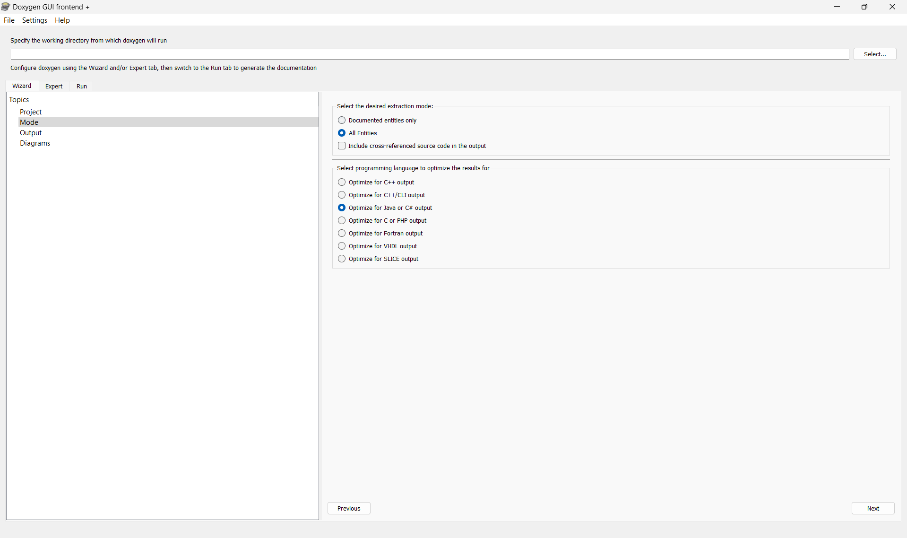

# Documentación de código con Doxygen

## Introducción

Doxygen es una herramienta que nos permite documentar nuestro código fuente de forma automática. Esta herramienta es muy
útil para mantener un código limpio y ordenado, ya que nos permite generar documentación de nuestro código de forma
sencilla.

En este tutorial, vamos a aprender cómo documentar nuestro código fuente con Doxygen. Vamos a ver cómo instalar Doxygen,
cómo configurarlo y cómo generar documentación de nuestro código.

## Instalación

Para instalar Doxygen, debemos seguir los siguientes pasos:

1. Descargar Doxygen desde la página oficial de
   Doxygen: [https://www.doxygen.nl/index.html](https://www.doxygen.nl/index.html).
2. Instalar Doxygen en nuestro sistema.
3. Ejecutar la herramienta Doxywizard para configurar Doxygen.

## Configuración

Para configurar Doxygen, debemos seguir los siguientes pasos:

1. Abrir Doxywizard.
2. Seleccionar la raíz de nuestro proyecto como directorio de trabajo.
3. Seleccionar la carpeta `src` como directorio de entrada.
    * De igual manera deberás seleccionar la opción `Scan recursively` para que Doxygen pueda leer todos los archivos
      de código fuente.
4. Seleccionar la misma carpeta `raíz` como directorio de salida.
5. Seleccionar documentar todas las entidades (_All entities_).
6. Seleccionar la opción de optimización para Java (_Optimize for Java_).
7. Marcar únicamente la salida como HTML con función de búsqueda (_HTML output with search function_).
8. Dejar la configuración de diagramas por defecto.
9. Generar la documentación.





## Generación de documentación

Para que doxygen trabaje correctamente, deberemos de documentar nuestro código fuente con comentarios especiales. Estos
comentarios especiales son reconocidos por Doxygen y se utilizan para generar la documentación.

Los comentarios especiales de Doxygen tienen la siguiente estructura:

```java
/**
 * Descripción de la función o clase.
 * @param parametro Descripción del parámetro.
 * @return Descripción del valor de retorno.
 */
public void ejemplo(int parametro) {
    // Código de la función.
}
```

En el ejemplo anterior, el comentario especial `/**` indica que es un comentario especial de Doxygen. Las etiquetas
`@param`, `@return`, etc., se utilizan para describir los parámetros, el valor de retorno, etc., de la función o clase.

## Ejemplo de documentación

A continuación, se muestra un ejemplo de documentación de una clase en Java:

```java
/**
 * Clase que define un panel con una imagen de fondo.
 */
public abstract class BackgroundPanel extends JPanel {

    /**
     * Imagen de fondo del panel.
     */
    protected ImageIcon backgroundImage;
    /**
     * Dimensiones del panel.
     */
    protected Dimension dimension;

    /**
     * Constructor de la clase.
     */
    public BackgroundPanel() {
        init();
    }

    protected abstract void init();

    /**
     * Establece las dimensiones del panel.
     *
     * @param dimension Dimensiones del panel.
     */
    public void setDimension(Dimension dimension) {
        this.dimension = dimension;
    }
}
```

En el ejemplo anterior, se documenta la clase `BackgroundPanel` con comentarios especiales de Doxygen. Se describen los
atributos, métodos y constructores de la clase con comentarios especiales que indican su propósito y uso.

## Conclusión

Doxygen es una herramienta muy útil para documentar nuestro código fuente de forma automática. Nos permite mantener un
código limpio y ordenado, y generar documentación de nuestro código de forma sencilla. Con Doxygen, podemos documentar
nuestro código de forma clara y concisa, y facilitar su mantenimiento y comprensión.