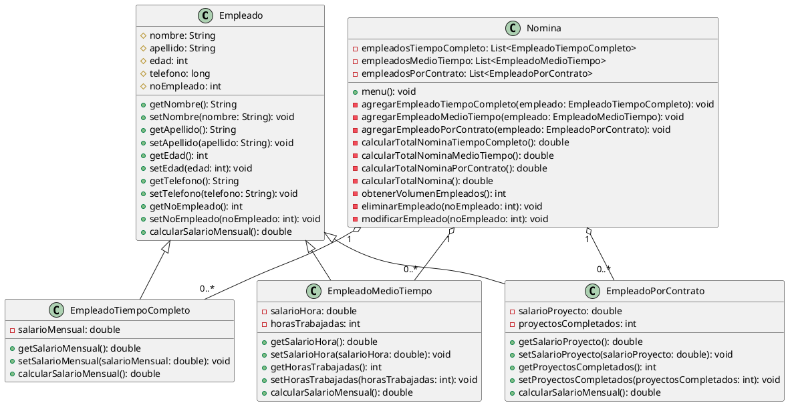

# Ejemplo 2: Administración de nómina de diferentes tipos de empleados (Herencia)

## Descripción del Problema

Una empresa desea implementar un sistema de administración de nómina para sus empleados. La empresa tiene diferentes
tipos de empleados, como empleados de tiempo completo, empleados de medio tiempo y empleados por contrato. Cada tipo de
empleado tiene diferentes atributos y métodos asociados. Por ejemplo, los empleados de tiempo completo tienen un salario
mensual fijo, mientras que los empleados de medio tiempo tienen un salario por hora y las horas trabajadas. Los
empleados por contrato tienen un salario por proyecto y el número de proyectos completados.

Además de ellos la empresa desea poder controlar en todo momento el volumen de empleados que tiene en su nómina, así
como el total de la nómina que se debe pagar a los empleados de cada tipo.

Como detalles adicionales, la empresa desea poder eliminar un empleado de la nómina, modificar los datos de un empleado
de la nómina y salir del sistema.

Los datos que todo empleado debe tener son:

* Nombre
* Apellido
* Edad
* Teléfono
* No. de empleado

## Requerimientos del Sistema

El sistema debe permitir:

1. Registrar un nuevo empleado de tiempo completo con su salario mensual fijo.
2. Registrar un nuevo empleado de medio tiempo con su salario por hora y las horas trabajadas.
3. Registrar un nuevo empleado por contrato con su salario por proyecto y el número de proyectos completados.
4. Calcular el salario mensual de un empleado de tiempo completo.
5. Calcular el salario mensual de un empleado de medio tiempo.
6. Calcular el salario mensual de un empleado por contrato.
7. Calcular el total de la nómina que se debe pagar a los empleados de cada tipo.
8. Mostrar el volumen de empleados que tiene en su nómina.
9. Mostrar el total de la nómina que se debe pagar a todos los empleados.
10. Eliminar un empleado de la nómina.
11. Modificar los datos de un empleado de la nómina.
12. Salir del sistema.

## Diagrama de Clases

El diagrama de clases para el sistema de administración de nómina se muestra a continuación:



## Implementación

La implementación del sistema de administración de nómina se realizará en Java utilizando el concepto de herencia para
representar los diferentes tipos de empleados. Se creará una clase `Empleado` como clase base y las clases
`EmpleadoTiempoCompleto`, `EmpleadoMedioTiempo` y `EmpleadoPorContrato` como subclases que heredan de la clase
`Empleado`.

Además, se creará una clase `Nomina` que contendrá las listas de empleados de tiempo completo, medio tiempo y por
contrato, así como los métodos para realizar las operaciones requeridas en el sistema.

## Implementación en Java

A continuación se muestra la implementación de las clases `Empleado`, `EmpleadoTiempoCompleto`, `EmpleadoMedioTiempo`,
`EmpleadoPorContrato` y `Nomina` en Java:

### Clase `Empleado`

```java
public class Empleado {
    private static int contadorEmpleados = 999;
    private String nombre;
    private String apellido;
    private int edad;
    private long telefono;
    private final int noEmpleado;
    
    public Empleado(){
        
        nombre= JOptionPane.showInputDialog("Ingrese el nombre del empleado");
        apellido= JOptionPane.showInputDialog("Ingrese el apellido del empleado");
        edad= Integer.parseInt(JOptionPane.showInputDialog("Ingrese la edad del empleado"));
        telefono= Long.parseLong(JOptionPane.showInputDialog("Ingrese el telefono del empleado"));
        noEmpleado= ++contadorEmpleados;
    }
    
    public double calcularSalarioMensual(){
        return 0;
    }
    
    public String toString(){
        return "Empleado %d: %s %s".formatted(noEmpleado, nombre, apellido);
    }
}
```

> **Nota:** En la clase `Empleado` se ha definido un atributo estático `contadorEmpleados` para asignar un número de
> empleado único a cada empleado registrado. El número de empleado se incrementa en 1 cada vez que se crea un nuevo
> empleado.

> Recuerda crear las funciones `get` y `set` para los atributos de la clase `Empleado` y para todas las clases que
> hereden de ella.
> {: .tip}

### Clase `EmpleadoTiempoCompleto`

```java
public class EmpleadoTiempoCompleto extends Empleado {
    private double salarioMensual;
    
    public EmpleadoTiempoCompleto(){
        super();
        salarioMensual= Double.parseDouble(JOptionPane.showInputDialog(
                    "Ingrese el salario mensual del empleado"));
    }
    
    @Override
    public double calcularSalarioMensual(){
        return salarioMensual;
    }
}
```

> En la clase `EmpleadoTiempoCompleto` se ha sobrescrito el método `calcularSalarioMensual` para calcular el salario
> mensual del empleado de tiempo completo. El salario mensual de un empleado de tiempo completo es el salario mensual
> fijo.

### Clase `EmpleadoMedioTiempo`

```java
public class EmpleadoMedioTiempo extends Empleado {
    private double salarioHora;
    private int horasTrabajadas;
    
    public EmpleadoMedioTiempo(){
        super();
        salarioHora= Double.parseDouble(JOptionPane.showInputDialog(
                    "Ingrese el salario por hora del empleado"));
        horasTrabajadas= Integer.parseInt(JOptionPane.showInputDialog(
                    "Ingrese las horas trabajadas del empleado por semana"));
    }
    
    @Override
    public double calcularSalarioMensual(){
        return salarioHora * horasTrabajadas * 4;
    }
}
```

> En la clase `EmpleadoMedioTiempo` se ha sobrescrito el método `calcularSalarioMensual` para calcular el salario
> mensual del empleado de medio tiempo. El salario mensual de un empleado de medio tiempo es el salario por hora
> multiplicado por las horas trabajadas por semana.

### Clase `EmpleadoPorContrato`

```java
public class EmpleadoPorContrato extends Empleado {
    private double salarioProyecto;
    private int proyectosCompletados;
    
    public EmpleadoPorContrato(){
        super();
        salarioProyecto= Double.parseDouble(JOptionPane.showInputDialog(
                    "Ingrese el salario por proyecto del empleado"));
        proyectosCompletados= Integer.parseInt(JOptionPane.showInputDialog(
                    "Ingrese el número de proyectos completados del empleado"));
    }
    
    @Override
    public double calcularSalarioMensual(){
        return salarioProyecto * proyectosCompletados;
    }
}
```

> En la clase `EmpleadoPorContrato` se ha sobrescrito el método `calcularSalarioMensual` para calcular el salario
> mensual del empleado por contrato. El salario mensual de un empleado por contrato es el salario por proyecto
> multiplicado por el número de proyectos completados.

### ¿Necesitamos algo más?

Para poder definir el menú de opciones y realizar las operaciones requeridas en el sistema, podemos hacer uso de un tipo
de dato `enum` para definir las opciones del menú y un objeto de la clase `Nomina` para gestionar la nómina de
empleados. Además de definir un tipo de dato `enum` para los tipos de empleados.

### Clase `TipoEmpleado`

```java
public enum TipoEmpleado {
    TIEMPO_COMPLETO,
    MEDIO_TIEMPO,
    POR_CONTRATO;
    
    private final String descripcion;
    
    private TipoEmpleado(){
        this.descripcion= this.name().replace("_", " ").toLowerCase();
    }
    
    @Override
    public String toString(){
        return "%d - Empleado: %s".formatted(this.ordinal() + 1, this.descripcion);
    }
}
```

> **Nota:** En la clase `TipoEmpleado` se ha definido un tipo de dato `enum` con los tipos de empleados disponibles:
> tiempo completo, medio tiempo y por contrato. Se ha sobrescrito el método `toString` para mostrar la descripción de
> cada tipo de empleado en el menú de opciones. Recordemos que la función `toString` se utiliza para convertir un objeto
> en una cadena de texto y es compartida por todas las clases en Java.

> La función `this.name()` devuelve el nombre del objeto `enum` en mayúsculas y con guiones bajos. Por ejemplo, el
> objeto `TIEMPO_COMPLETO` devolverá `"TIEMPO_COMPLETO"`.
> Por su parte, la función `this.ordinal()` devuelve la posición del objeto `enum` en la lista de objetos. Por ejemplo,
> el objeto `TIEMPO_COMPLETO` devolverá `0`.

### Clase `OpcionMenu`

```java
public enum OpcionMenu{
    ADD_FULL_TIME_EMPLOYEE("Agregar empleado de tiempo completo"),
    ADD_PART_TIME_EMPLOYEE("Agregar empleado de medio tiempo"),
    ADD_CONTRACT_EMPLOYEE("Agregar empleado por contrato"),
    CALCULATE_FULL_TIME_SALARY("Calcular salario mensual de empleado de tiempo completo"),
    CALCULATE_PART_TIME_SALARY("Calcular salario mensual de empleado de medio tiempo"),
    CALCULATE_CONTRACT_SALARY("Calcular salario mensual de empleado por contrato"),
    CALCULATE_TOTAL_SALARY_BY_TYPE("Calcular total de la nómina por tipo de empleado"),
    GET_EMPLOYEES_VOLUME("Obtener volumen de empleados"),
    GET_TOTAL_SALARY("Obtener total de la nómina"),
    DELETE_EMPLOYEE("Eliminar empleado"),
    MODIFY_EMPLOYEE("Modificar empleado"),
    EXIT("Salir");
    
    private final String descripcion;
    
    private OpcionMenu(String descripcion){
        this.descripcion= descripcion;
    }
    
    @Override
    public String toString(){
        return "%d - %s".formatted(this.ordinal() + 1, this.descripcion);
    }
}
```

### Clase `Nomina`

```java
import javax.swing.JOptionPane;
import java.util.ArrayList;

public class Nomina {
    private final ArrayList<EmpleadoTiempoCompleto> empleadosTiempoCompleto;
    private final ArrayList<EmpleadoMedioTiempo> empleadosMedioTiempo;
    private final ArrayList<EmpleadoPorContrato> empleadosPorContrato;
    
    public Nomina(){
        empleadosTiempoCompleto= new ArrayList<>();
        empleadosMedioTiempo= new ArrayList<>();
        empleadosPorContrato= new ArrayList<>();
    }
    
    public void menu(){
       
        OpcionMenu opcionSeleccionada=JOptionPane.showInputDialog(
                null,
                "Seleccione una opción:",
                "Menú de opciones",
                JOptionPane.QUESTION_MESSAGE,
                null,
                OpcionMenu.values(),
                OpcionMenu.values()[0]);
                
        switch(opcionSeleccionada){
            case ADD_FULL_TIME_EMPLOYEE -> agregarEmpleadoTiempoCompleto();
            case ADD_PART_TIME_EMPLOYEE -> agregarEmpleadoMedioTiempo();
            case ADD_CONTRACT_EMPLOYEE -> agregarEmpleadoPorContrato();
            case CALCULATE_FULL_TIME_SALARY -> calcularSalarioMensualEmpleadoTiempoCompleto();
            case CALCULATE_PART_TIME_SALARY -> calcularSalarioMensualEmpleadoMedioTiempo();
            case CALCULATE_CONTRACT_SALARY -> calcularSalarioMensualEmpleadoPorContrato();
            case CALCULATE_TOTAL_SALARY_BY_TYPE -> calcularTotalNomina();
            case GET_EMPLOYEES_VOLUME -> obtenerVolumenEmpleados();
            case GET_TOTAL_SALARY -> obtenerTotalNomina();
            case DELETE_EMPLOYEE -> eliminarEmpleado();
            case MODIFY_EMPLOYEE -> modificarEmpleado();
            case EXIT -> System.exit(0);
        }
    }
    
    private void agregarEmpleadoTiempoCompleto(){
        empleadosTiempoCompleto.add(new EmpleadoTiempoCompleto());
        menu();
    }
    
    private void agregarEmpleadoMedioTiempo(){
        empleadosMedioTiempo.add(new EmpleadoMedioTiempo());
        menu();
    }

    private void agregarEmpleadoPorContrato(){
        empleadosPorContrato.add(new EmpleadoPorContrato());
        menu();
    }
    
    private Empleado seleccionarEmpleado(){
        Empleado empleado= null;
        ArrayList<Empleado> empleados= new ArrayList<>();
        empleados.addAll(empleadosTiempoCompleto);
        empleados.addAll(empleadosMedioTiempo);
        empleados.addAll(empleadosPorContrato);
        empleado=JOptionPane.showInputDialog(
                null,
                "Seleccione un empleado:",
                "Lista de empleados",
                JOptionPane.QUESTION_MESSAGE,
                null,
                empleados.toArray(),
                empleados.get(0));
        return empleado;
    }
    
    private Empleado seleccionarEmpleadoTiempoCompleto(){
        Empleado empleado= null;
        empleado=JOptionPane.showInputDialog(
                null,
                "Seleccione un empleado:",
                "Lista de empleados",
                JOptionPane.QUESTION_MESSAGE,
                null,
                empleadosTiempoCompleto.toArray(),
                empleadosTiempoCompleto.get(0));
        return empleado;
    }
    
    private Empleado seleccionarEmpleadoMedioTiempo(){
        Empleado empleado= null;
        empleado=JOptionPane.showInputDialog(
                null,
                "Seleccione un empleado:",
                "Lista de empleados",
                JOptionPane.QUESTION_MESSAGE,
                null,
                empleadosMedioTiempo.toArray(),
                empleadosMedioTiempo.get(0));
        return empleado;
    }
    
    private Empleado seleccionarEmpleadoPorContrato(){
        Empleado empleado= null;
        empleado=JOptionPane.showInputDialog(
                null,
                "Seleccione un empleado:",
                "Lista de empleados",
                JOptionPane.QUESTION_MESSAGE,
                null,
                empleadosPorContrato.toArray(),
                empleadosPorContrato.get(0));
        return empleado;
    }
    
    private void calcularSalarioMensualEmpleadoTiempoCompleto(){
        EmpleadoTiempoCompleto empleado= (EmpleadoTiempoCompleto) seleccionarEmpleadoTiempoCompleto();
        JOptionPane.showMessageDialog(null, "El salario mensual del empleado es: %.2f".formatted(empleado.calcularSalarioMensual()));
        menu();
    }
    
    private void calcularSalarioMensualEmpleadoMedioTiempo(){
        EmpleadoMedioTiempo empleado= (EmpleadoMedioTiempo) seleccionarEmpleadoMedioTiempo();
        JOptionPane.showMessageDialog(null, "El salario mensual del empleado es: %.2f".formatted(empleado.calcularSalarioMensual()));
        menu();
    }
    
    private void calcularSalarioMensualEmpleadoPorContrato(){
        EmpleadoPorContrato empleado= (EmpleadoPorContrato) seleccionarEmpleadoPorContrato();
        JOptionPane.showMessageDialog(null, "El salario mensual del empleado es: %.2f".formatted(empleado.calcularSalarioMensual()));
        menu();
    }
    
    private double calcularTotalNominaTiempoCompleto(){
        double total= 0;
        for(EmpleadoTiempoCompleto empleado: empleadosTiempoCompleto){
            total+= empleado.calcularSalarioMensual();
        }
        return total;
    }
    
    private double calcularTotalNominaMedioTiempo(){
        double total= 0;
        for(EmpleadoMedioTiempo empleado: empleadosMedioTiempo){
            total+= empleado.calcularSalarioMensual();
        }
        return total;
    }
    
    private double calcularTotalNominaPorContrato(){
        double total= 0;
        for(EmpleadoPorContrato empleado: empleadosPorContrato){
            total+= empleado.calcularSalarioMensual();
        }
        return total;
    }
    
    private void calcularTotalNomina(){
        double totalTiempoCompleto= calcularTotalNominaTiempoCompleto();
        double totalMedioTiempo= calcularTotalNominaMedioTiempo();
        double totalPorContrato= calcularTotalNominaPorContrato();
        JOptionPane.showMessageDialog(null, """
                Total de la nómina:
                Empleados de tiempo completo: %.2f
                Empleados de medio tiempo: %.2f
                Empleados por contrato: %.2f
                """.formatted(totalTiempoCompleto, totalMedioTiempo, totalPorContrato));
        menu();
    }
    
    private int obtenerVolumenEmpleados(){
        int volumen= empleadosTiempoCompleto.size() + empleadosMedioTiempo.size() + empleadosPorContrato.size();
        JOptionPane.showMessageDialog(null, "Volumen de empleados: %d".formatted(volumen));
        return volumen;
    }
    
    private void obtenerTotalNomina(){
        double total= calcularTotalNominaTiempoCompleto() + calcularTotalNominaMedioTiempo() + calcularTotalNominaPorContrato();
        JOptionPane.showMessageDialog(null, "Total de la nómina: %.2f".formatted(total));
        menu();
    }
    
    private void eliminarEmpleado(){
        Empleado empleado= seleccionarEmpleado();
        if(empleado instanceof EmpleadoTiempoCompleto){
            empleadosTiempoCompleto.remove((EmpleadoTiempoCompleto) empleado);
        } else if(empleado instanceof EmpleadoMedioTiempo){
            empleadosMedioTiempo.remove((EmpleadoMedioTiempo) empleado);
        } else if(empleado instanceof EmpleadoPorContrato){
            empleadosPorContrato.remove((EmpleadoPorContrato) empleado);
        }
        menu();
    }
    
    private void modificarEmpleado(){
        Empleado empleado= seleccionarEmpleado();
        empleado.setNombre(JOptionPane.showInputDialog("Ingrese el nombre del empleado"));
        empleado.setApellido(JOptionPane.showInputDialog("Ingrese el apellido del empleado"));
        empleado.setEdad(Integer.parseInt(JOptionPane.showInputDialog("Ingrese la edad del empleado")));
        empleado.setTelefono(Long.parseLong(JOptionPane.showInputDialog("Ingrese el telefono del empleado"));
        if(empleado instanceof EmpleadoTiempoCompleto){
            EmpleadoTiempoCompleto empleadoTiempoCompleto= (EmpleadoTiempoCompleto) empleado;
            empleadoTiempoCompleto.setSalarioMensual(Double.parseDouble(JOptionPane.showInputDialog("Ingrese el salario mensual del empleado")));
        } else if(empleado instanceof EmpleadoMedioTiempo){
            EmpleadoMedioTiempo empleadoMedioTiempo= (EmpleadoMedioTiempo) empleado;
            empleadoMedioTiempo.setSalarioHora(Double.parseDouble(JOptionPane.showInputDialog("Ingrese el salario por hora del empleado")));
            empleadoMedioTiempo.setHorasTrabajadas(Integer.parseInt(JOptionPane.showInputDialog("Ingrese las horas trabajadas del empleado por semana")));
        } else if(empleado instanceof EmpleadoPorContrato){
            EmpleadoPorContrato empleadoPorContrato= (EmpleadoPorContrato) empleado;
            empleadoPorContrato.setSalarioProyecto(Double.parseDouble(JOptionPane.showInputDialog("Ingrese el salario por proyecto del empleado")));
            empleadoPorContrato.setProyectosCompletados(Integer.parseInt(JOptionPane.showInputDialog("Ingrese el número de proyectos completados del empleado")));
        }
        menu();
    }
    
    public static void main(String[] args){
        Nomina nomina= new Nomina();
        nomina.menu();
    }
}
```

> **Nota:** En la selección de empleados se ha utilizado un `ArrayList` para almacenar todos los empleados registrados
> en la nómina. Luego, se ha utilizado el método `showInputDialog` de la clase `JOptionPane` para mostrar una lista de
> empleados y permitir al usuario seleccionar uno de ellos.

> Además de la selección de un empleado de toda la nómina, se ha implementado la selección de empleados por tipo para
> facilitar la gestión de empleados de tiempo completo, medio tiempo y por contrato.

> Para el cálculo de la nómina por tipo de empleado se ha recorido cada lista de empleados y se ha sumado el salario
> mensual de cada empleado. Este valor puede ser usado de forma aislado o en conjunto con los otros tipos de empleados
> para obtener el total de la nómina.

Podemos aún modificar las clases de `Empleado` y sus derivadas para definir una función sobreescrita que nos permita
actualizar los datos de un empleado.

Si ese fuera el caso, las clases `Empleado`, `EmpleadoTiempoCompleto`, `EmpleadoMedioTiempo` y `EmpleadoPorContrato`
quedarían de la siguiente manera:

### Clase `Empleado` sobreescrita

```java
public class Empleado {
    private static int contadorEmpleados = 999;
    private String nombre;
    private String apellido;
    private int edad;
    private long telefono;
    private final int noEmpleado;
    
    public Empleado(){
        
        nombre= JOptionPane.showInputDialog("Ingrese el nombre del empleado");
        apellido= JOptionPane.showInputDialog("Ingrese el apellido del empleado");
        edad= Integer.parseInt(JOptionPane.showInputDialog("Ingrese la edad del empleado"));
        telefono= Long.parseLong(JOptionPane.showInputDialog("Ingrese el telefono del empleado"));
        noEmpleado= ++contadorEmpleados;
    }
    
    public double calcularSalarioMensual(){
        return 0;
    }
    
    public void actualizarDatos(){
        nombre= JOptionPane.showInputDialog("Ingrese el nombre del empleado");
        apellido= JOptionPane.showInputDialog("Ingrese el apellido del empleado");
        edad= Integer.parseInt(JOptionPane.showInputDialog("Ingrese la edad del empleado"));
        telefono= Long.parseLong(JOptionPane.showInputDialog("Ingrese el telefono del empleado"));
    }
    
    public String toString(){
        return "Empleado %d: %s %s".formatted(noEmpleado, nombre, apellido);
    }
}
```

### Clase `EmpleadoTiempoCompleto` sobreescrita

```java
public class EmpleadoTiempoCompleto extends Empleado {
    private double salarioMensual;
    
    public EmpleadoTiempoCompleto(){
        super();
        salarioMensual= Double.parseDouble(JOptionPane.showInputDialog(
                    "Ingrese el salario mensual del empleado"));
    }
    
    @Override
    public double calcularSalarioMensual(){
        return salarioMensual;
    }
    
    @Override
    public void actualizarDatos(){
        super.actualizarDatos();
        salarioMensual= Double.parseDouble(JOptionPane.showInputDialog(
                    "Ingrese el salario mensual del empleado"));
    }
}
```

### Clase `EmpleadoMedioTiempo` sobreescrita

```java
public class EmpleadoMedioTiempo extends Empleado {
    private double salarioHora;
    private int horasTrabajadas;
    
    public EmpleadoMedioTiempo(){
        super();
        salarioHora= Double.parseDouble(JOptionPane.showInputDialog(
                    "Ingrese el salario por hora del empleado"));
        horasTrabajadas= Integer.parseInt(JOptionPane.showInputDialog(
                    "Ingrese las horas trabajadas del empleado por semana"));
    }
    
    @Override
    public double calcularSalarioMensual(){
        return salarioHora * horasTrabajadas * 4;
    }
    
    @Override
    public void actualizarDatos(){
        super.actualizarDatos();
        salarioHora= Double.parseDouble(JOptionPane.showInputDialog(
                    "Ingrese el salario por hora del empleado"));
        horasTrabajadas= Integer.parseInt(JOptionPane.showInputDialog(
                    "Ingrese las horas trabajadas del empleado por semana"));
    }
}
```

### Clase `EmpleadoPorContrato` sobreescrita

```java
public class EmpleadoPorContrato extends Empleado {
    private double salarioProyecto;
    private int proyectosCompletados;
    
    public EmpleadoPorContrato(){
        super();
        salarioProyecto= Double.parseDouble(JOptionPane.showInputDialog(
                    "Ingrese el salario por proyecto del empleado"));
        proyectosCompletados= Integer.parseInt(JOptionPane.showInputDialog(
                    "Ingrese el número de proyectos completados del empleado"));
    }
    
    @Override
    public double calcularSalarioMensual(){
        return salarioProyecto * proyectosCompletados;
    }
    
    @Override
    public void actualizarDatos(){
        super.actualizarDatos();
        salarioProyecto= Double.parseDouble(JOptionPane.showInputDialog(
                    "Ingrese el salario por proyecto del empleado"));
        proyectosCompletados= Integer.parseInt(JOptionPane.showInputDialog(
                    "Ingrese el número de proyectos completados del empleado"));
    }
}
```

Por su parte, la función de `modificarEmpleado` en la clase `Nomina` quedaría de la siguiente manera:

```java
private void modificarEmpleado(){
    Empleado empleado= seleccionarEmpleado();
    empleado.actualizarDatos();
    menu();
}
```