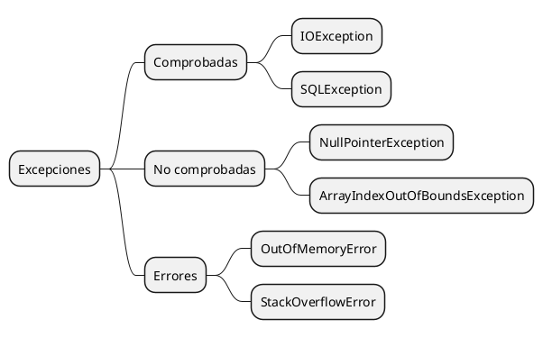
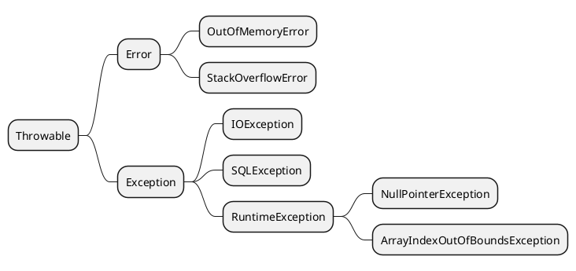

# Excepciones

Las excepciones son errores que ocurren durante la ejecución de un programa. Estos errores pueden ser causados por el
usuario, el programador o el sistema. Las excepciones pueden ser manejadas por el programa o pueden ser ignoradas. En
Java, las excepciones son objetos que se lanzan cuando ocurre un error. Las excepciones pueden ser lanzadas por el
sistema o por el programador.

## Tipos de excepciones

En Java, las excepciones se dividen en dos categorías principales: excepciones comprobadas y excepciones no comprobadas.



- **Excepciones comprobadas**: Son excepciones que el compilador obliga a manejar. Estas excepciones deben ser
  capturadas o lanzadas por el programador. Ejemplos de excepciones comprobadas son `IOException` y `SQLException`.
- **Excepciones no comprobadas**: Son excepciones que el compilador no obliga a manejar. Estas excepciones pueden ser
  capturadas o lanzadas por el programador. Ejemplos de excepciones no comprobadas son `NullPointerException` y
  `ArrayIndexOutOfBoundsException`.
- **Errores**: Son excepciones que ocurren en tiempo de ejecución y que no pueden ser manejadas por el programador.
  Ejemplos de errores son `OutOfMemoryError` y `StackOverflowError`.

## Jerarquía de excepciones en Java

En Java, todas las excepciones son subclases de la clase `Throwable`. La clase `Throwable` tiene dos subclases
principales:



## Manejo de excepciones

En Java, las excepciones se manejan mediante bloques `try-catch`. Un bloque `try` contiene el código que puede lanzar
una excepción, y un bloque `catch` maneja la excepción lanzada. Un bloque `finally` se ejecuta siempre,
independientemente de si se lanza una excepción o no.

```java
try {
    // Código que puede lanzar una excepción
} catch (Exception e) {
    // Manejo de la excepción
} finally {
    // Código que se ejecuta siempre
}
```

> **Nota**: El bloque `finally` es opcional y se utiliza para liberar recursos o realizar tareas de limpieza.
> El bloque `catch` puede manejar excepciones específicas o excepciones genéricas.
> El bloque `finally` se ejecuta siempre, independientemente de si se lanza una excepción o no. Aunque no es
> obligatorio y no es correcto usarlo para liberar recursos o depender de él para cerrar flujos de datos.

Además de los bloques `try-catch-finally`, Java también proporciona la palabra clave `throws` para propagar
excepciones a métodos superiores. La palabra clave `throws` se utiliza en la firma de un método para indicar que el
método puede lanzar una excepción.

```java
public void readFile() throws IOException {
    // Código que puede lanzar una excepción
    throw new IOException("Error reading file");
}
```

## Creación de excepciones personalizadas

En Java, también puedes crear tus propias excepciones personalizadas. Para crear una excepción personalizada, debes
crear una clase que extienda la clase `Exception` o una de sus subclases. A continuación, se muestra un ejemplo de cómo
crear una excepción personalizada en Java:

```java
public class CustomException extends Exception {
    public CustomException(String message) {
        super(message);
    }
}
```

En este ejemplo, la clase `CustomException` extiende la clase `Exception` y proporciona un constructor que acepta un
mensaje de error. La clase `CustomException` puede ser lanzada y manejada de la misma manera que otras excepciones en
Java.