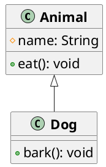
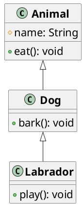
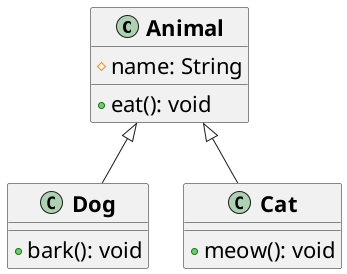

# Tipos de herencia en Java

La herencia es un concepto fundamental en la programación orientada a objetos. En Java, existen varios tipos de herencia
que se pueden utilizar para modelar diferentes relaciones entre clases. Algunos de los tipos comunes de herencia en Java
son:

## Herencia simple

La herencia simple es el tipo más común de herencia en Java. En la herencia simple, una clase derivada hereda de una
sola clase base. La clase derivada puede agregar nuevos atributos y métodos, o modificar los existentes, pero hereda
todos los atributos y métodos de la clase base.



```java
public class Animal {

    protected String name;
    
    public void eat() {
    
        System.out.println("Comiendo...");
    }
}

public class Dog extends Animal {

    public void bark() {
    
        System.out.println("Ladrando...");
    }
}
```

En este ejemplo, la clase `Dog` hereda de la clase `Animal`, lo que significa que la clase `Dog` tiene acceso al método
`eat` de la clase `Animal`.

## Herencia multinivel

La herencia multinivel es un tipo de herencia en la que una clase derivada hereda de otra clase derivada. En otras
palabras, una clase puede ser derivada de otra clase que a su vez es derivada de otra clase. Esto crea una cadena de
herencia en la que cada clase hereda los atributos y métodos de la clase anterior en la cadena.



```java
public class Animal {

    protected String name;
    
    public void eat() {
    
        System.out.println("Comiendo...");
    }
}

public class Dog extends Animal {

    public void bark() {
    
        System.out.println("Ladrando...");
    }
}

public class Labrador extends Dog {

    public void play() {
    
        System.out.println("Jugando...");
    }
}
```

En este ejemplo, la clase `Labrador` hereda de la clase `Dog`, que a su vez hereda de la clase `Animal`. Esto significa
que la clase `Labrador` tiene acceso a los métodos `eat` y `bark` de las clases `Animal` y `Dog`, respectivamente.

## Herencia jerárquica

La herencia jerárquica es un tipo de herencia en la que varias clases derivadas heredan de una sola clase base. En
otras palabras, una clase base puede tener múltiples clases derivadas que heredan sus atributos y métodos.





```java
public class Animal {

    protected String name;
    
    public void eat() {
    
        System.out.println("Comiendo...");
    }
}

public class Dog extends Animal {
    
    public void bark() {
    
        System.out.println("Ladrando...");
    }
}

public class Cat extends Animal {
    
    public void meow() {
    
        System.out.println("Maullando...");
    }
}
```

En este ejemplo, las clases `Dog` y `Cat` heredan de la clase `Animal`, lo que significa que ambas clases tienen acceso
al método `eat` de la clase `Animal`.