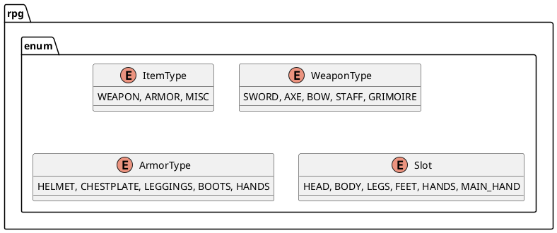
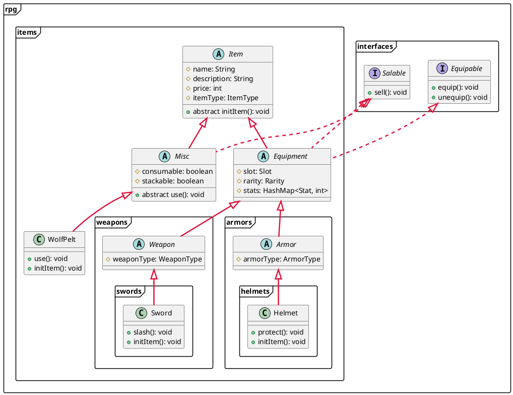
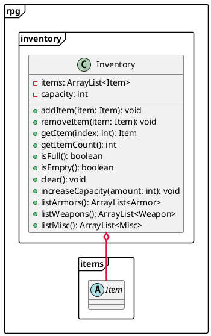

# 8. El inventario de Objetos

El inventario de objetos es una estructura de datos que se utiliza para almacenar y gestionar una colección de objetos
en un programa. Es una forma eficiente de organizar y acceder a los objetos de manera estructurada, lo que facilita la
manipulación y gestión de los mismos.

Para nuestro juego de rol, el inventario de objetos es una parte fundamental, ya que nos permite almacenar y gestionar
los objetos que los personajes pueden adquirir, equipar y utilizar durante el juego. En este capítulo, veremos cómo
implementar un inventario de objetos en Java utilizando arreglos y listas.

## Diagrama de Clases

Antes de comenzar a implementar el inventario de objetos, vamos a definir la estructura de clases que utilizaremos para
representar los objetos y el inventario en nuestro juego de rol. El siguiente diagrama de clases muestra las clases
`Objeto`, `Arma`, `Armadura` e `Inventario` y sus relaciones:

### Tipos Enumerados



### Clases



### Inventario



## Implementación

Ahora que hemos definido la estructura de clases para nuestro inventario de objetos, vamos a implementar las clases
`Objeto`, `Arma`, `Armadura` e `Inventario` en nuestro juego de rol. A continuación, se muestra un ejemplo de cómo
podríamos implementar estas clases en Java:

### Clase `Objeto`

```java
package rpg.items;

import rpg.enums.ItemType;

public abstract class Item {
    protected String name;
    protected String description;
    protected int price;
    protected ItemType itemType;

    public Item(String name, String description, int price, ItemType itemType) {
        this.name = name;
        this.description = description;
        this.price = price;
        this.itemType = itemType;
    }

    public String getName() {
        return name;
    }

    public String getDescription() {
        return description;
    }

    public int getPrice() {
        return price;
    }

    public ItemType getItemType() {
        return itemType;
    }
}
```

### Clase `Arma`

```java
package rpg.items.weapons;

import rpg.enums.ItemType;
import rpg.enums.WeaponType;
import rpg.items.Equipment;

import java.util.HashMap;

public abstract class Weapon extends Equipment {
    protected WeaponType weaponType;

    public Weapon(String name, String description, int price, WeaponType weaponType) {
        super(name, description, price, ItemType.WEAPON);
        this.weaponType = weaponType;
    }

    public WeaponType getWeaponType() {
        return weaponType;
    }
}
```

### Clase `Armadura`

```java
package rpg.items.armors;

import rpg.enums.ArmorType;
import rpg.enums.ItemType;
import rpg.items.Equipment;

import java.util.HashMap;

public abstract class Armor extends Equipment {
    protected ArmorType armorType;

    public Armor(String name, String description, int price, ArmorType armorType) {
        super(name, description, price, ItemType.ARMOR);
        this.armorType = armorType;
    }

    public ArmorType getArmorType() {
        return armorType;
    }
}
```

### Conclusiones

En este capítulo, hemos visto cómo implementar un inventario de objetos en Java utilizando arreglos y listas. Hemos
definido la estructura de clases para representar los objetos y el inventario en nuestro juego de rol, y hemos
implementado las clases `Objeto`, `Arma`, `Armadura` e `Inventario` en nuestro juego de rol. Ahora que tenemos un
inventario de objetos funcional, podemos comenzar a agregar objetos al juego y permitir a los personajes adquirir,
equipar y utilizar estos objetos durante el juego.

En el siguiente capítulo, veremos cómo implementar un sistema de combate en nuestro juego de rol, que permitirá a los
personajes luchar contra enemigos y ganar experiencia y recompensas por sus victorias.