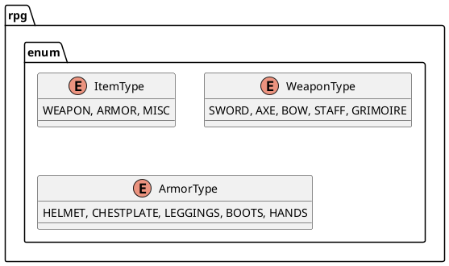

# 8. El inventario de Objetos

El inventario de objetos es una estructura de datos que se utiliza para almacenar y gestionar una colección de objetos
en un programa. Es una forma eficiente de organizar y acceder a los objetos de manera estructurada, lo que facilita la
manipulación y gestión de los mismos.

Para nuestro juego de rol, el inventario de objetos es una parte fundamental, ya que nos permite almacenar y gestionar
los objetos que los personajes pueden adquirir, equipar y utilizar durante el juego. En este capítulo, veremos cómo
implementar un inventario de objetos en Java utilizando arreglos y listas.

## Diagrama de Clases

Antes de comenzar a implementar el inventario de objetos, vamos a definir la estructura de clases que utilizaremos para
representar los objetos y el inventario en nuestro juego de rol. El siguiente diagrama de clases muestra las clases
`Objeto`, `Arma`, `Armadura` e `Inventario` y sus relaciones:



```plantuml
@startuml
class Item{
    
}
package rpg.inventory{
    Item
}
@enduml
```