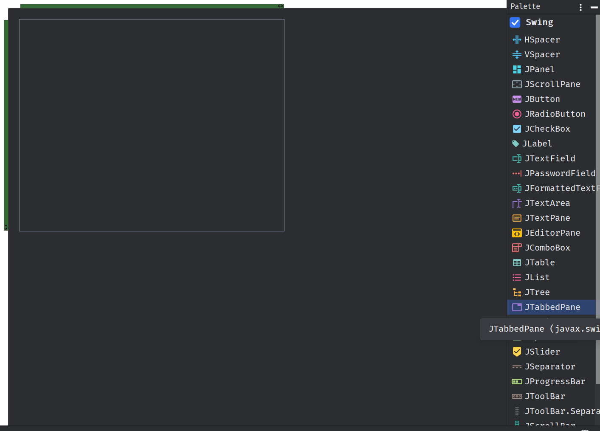
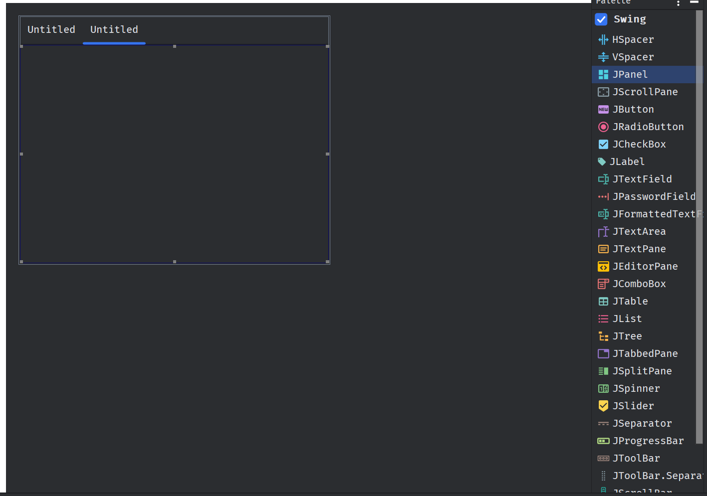

# El componente `JTabbedPane`

El componente `JTabbedPane` es un contenedor de pestañas que permite mostrar varios paneles en una sola ventana. Cada
pestaña puede contener un panel diferente, lo que permite organizar la información de forma clara y ordenada. El
`JTabbedPane` es un componente muy útil para crear interfaces de usuario complejas con múltiples secciones o vistas.

En esta sección, vamos a crear un `JTabbedPane` que contendrá varias pestañas con diferentes paneles. Cada pestaña
representará una sección diferente de la aplicación y contendrá un panel específico con información relacionada.

## Creación de un `JTabbedPane`

Para crear un `JTabbedPane` en Java, vamos a seguir los siguientes pasos:

1. Crearemos un `GUI Component` en el editor de diseño de IntelliJ IDEA.
2. Seleccionaremos el componente `JTabbedPane` y lo agregaremos al formulario.
3. Personalizaremos las pestañas y los paneles del `JTabbedPane` según nuestras necesidades.
4. Agregaremos los componentes necesarios a cada panel del `JTabbedPane`.
5. Configuraremos el `JTabbedPane` para que se muestre correctamente en la ventana principal.
6. Probaremos el `JTabbedPane` para asegurarnos de que funcione correctamente.
7. Añadiremos funcionalidad adicional al `JTabbedPane` según sea necesario.
8. Documentaremos el código y agregaremos comentarios para facilitar su mantenimiento.
9. Ejecutaremos la aplicación y verificaremos que el `JTabbedPane` funcione correctamente.

Con estos pasos, podremos crear un `JTabbedPane` en Java y utilizarlo para organizar la información de nuestra
aplicación de forma clara y ordenada.

## Imágenes de explicación

Como puedes ver, el componente está en la barra de herramientas de la derecha en IntelliJ IDEA. Puedes arrastrarlo al
formulario y personalizarlo según tus necesidades.

Puedes agregar al panel nuevos JPanels, para crear una nueva pestaña en el `JTabbedPane`. Cada panel puede contener
diferentes componentes según lo que necesites mostrar en esa sección de la aplicación.

## Conclusión

El componente `JTabbedPane` es una herramienta muy útil para organizar la información en una aplicación de escritorio 
en Java. Con él, puedes crear interfaces de usuario complejas con múltiples secciones y vistas, lo que facilita la
navegación y la presentación de la información al usuario. Espero que este tutorial te haya sido de ayuda y que puedas
aplicar estos conocimientos en tus proyectos futuros. ¡Buena suerte!# Writerside
