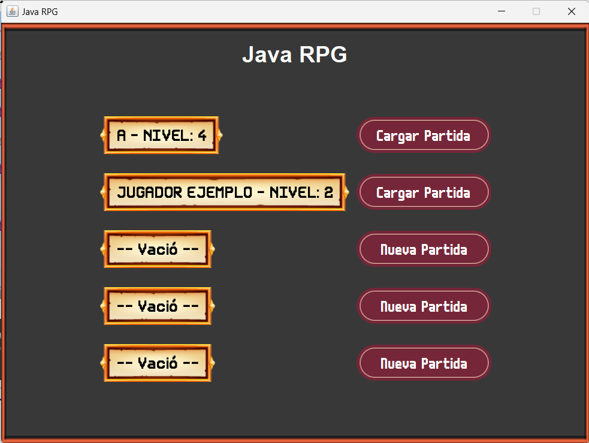

# 24. Las ventanas de la aplicación

Además de la ventana principal, necesitaremos otras ventanas para mostrar información al jugador y permitirle
interactuar con el juego. En este capítulo, crearemos las ventanas necesarias para cargar partidas y para crear un
nuevo personaje.

## Ventana de carga de partida

La ventana de carga de partida permitirá al jugador seleccionar una partida guardada para cargarla y continuar jugando.

### Estructura de la ventana

La ventana de carga de partida estará compuesta por los siguientes elementos:

1. **Lista de partidas:** En esta lista se mostrarán las partidas guardadas, con información como el nombre del
   personaje, el nivel, la fecha de guardado, etc.
2. **Botones de acción:** Junto a cada partida, habrá un botón para cargar la partida o crear un nuevo personaje.
3. **Etiqueta de información:** En la parte superior de la ventana, habrá una etiqueta que mostrará el nombre del juego.

De tal manera que nuestra ventana se vea así:

{display:block}

> **Nota:** Para efectos prácticos, llamaremos a esta ventana `StartWindow`.

### Creando la ventana de carga de partida

Para crear la ventana de carga de partida, seguiremos los siguientes pasos:

1. Crearemos una nueva ventana y haremos que la clase asociada extienda de `JFrame`.
2. En vista de diseño de la ventana, agregaremos primero una etiqueta en la parte superior que muestre el nombre del
   juego.
3. Debajo de la etiqueta, agregaremos un `JPanel` que contendrá una lista de partidas guardadas. Para esto, puedes
   utilizar un `JList` o un `JTable`. O bien puedes crear un conjunto de etiquetas y botones que representen cada
   partida guardada. (En el ejemplo se utilizarán 5 partidas guardadas).

> **Nota:** Si utilizas un `JList` o un `JTable`, recuerda agregar un `JScrollPane` para que el jugador pueda
> desplazarse por la lista de partidas.

### Configurando la ventana de carga de partida

Si seguimos los pasos anteriores, deberemos hacer que tanto el panel principal, como la lista de partidas y los botones
de acción tengan habilitado la opción de `Custom Create` para poder modificar sus propiedades.

Y por consiguiente deberemos de hacer que la función `createUIComponents` de la ventana de carga de partida se vea de
la siguiente manera:

```java
    private void createUIComponents() {

        mainPanel = new FilesPanel();
        titleLabel = new JLabel("Java RPG");
        titleLabel.setForeground(Color.WHITE);
        titleLabel.setFont(new Font("Arial", Font.BOLD, 30));
        file1Name = new NameLabel("");
        newFile1 = new NewFileButton(1, this);
        loadFile1 = new LoadFileButton(1, this);
        file2Name = new NameLabel("");
        newFile2 = new NewFileButton(2, this);
        loadFile2 = new LoadFileButton(2, this);
        file3Name = new NameLabel("");
        newFile3 = new NewFileButton(3, this);
        loadFile3 = new LoadFileButton(3, this);
        file4Name = new NameLabel("");
        newFile4 = new NewFileButton(4, this);
        loadFile4 = new LoadFileButton(4, this);
        file5Name = new NameLabel("");
        newFile5 = new NewFileButton(5, this);
        loadFile5 = new LoadFileButton(5, this);
    }
```

Como puedes ver en el código anterior, se crean los elementos necesarios para la ventana de carga de partida, como la
etiqueta del título, las etiquetas de los nombres de las partidas, los botones para crear y cargar partidas, etc.

> **Nota:** En el ejemplo anterior, la clase `FilesPanel` es una clase que extiende de `BackgroundPanel` y que se
> encarga de mostrar el fondo de la ventana de carga de partida.

> **Nota:** Las clases `NewFileButton` y `LoadFileButton` son clases que extienden de `BaseButton` y que se encargan
> de crear y cargar partidas, respectivamente. Aunque puedes hacer que `LoadFileButton` extienda de `NewFileButton`
> para reutilizar el código.

## Conclusiones

En este capítulo, hemos creado la ventana de carga de partida, que permitirá al jugador seleccionar una partida guardada
para cargarla y continuar jugando. Hemos visto cómo estructurar la ventana y cómo crear los elementos necesarios para
mostrar la información de las partidas guardadas y permitir al jugador interactuar con ellas.

En el siguiente capítulo, crearemos la ventana de creación de personaje, que permitirá al jugador crear un nuevo
personaje para comenzar una nueva partida.