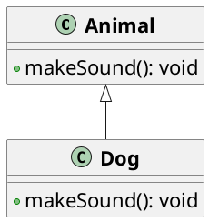

# Sobrescritura de Métodos

La sobrescritura de métodos es un concepto de la programación orientada a objetos que permite a una subclase
proporcionar una implementación específica de un método que ya está definido en su superclase. Esto permite a las
subclases modificar o extender el comportamiento de los métodos heredados de la superclase.

## Ejemplo de sobrescritura



```java
public class Animal {

    public void makeSound() {
    
        System.out.println("Sonido genérico de animal...");
    }
}

public class Dog extends Animal {

    @Override
    public void makeSound() {
    
        System.out.println("Guau guau!");
    }
}
```

En este ejemplo, la clase `Dog` sobrescribe el método `makeSound` de la clase `Animal` para proporcionar una
implementación específica del sonido de un perro.

## Llamada a métodos sobrescritos

```java
Animal animal = new Dog();
// Llamada al método sobrescrito
// Se infiere que se llama al método makeSound de Dog
animal.makeSound();
```

En este ejemplo, se crea una instancia de la clase `Dog` y se asigna a una referencia de tipo `Animal`. Cuando se
llama al método `makeSound` a través de la referencia de tipo `Animal`, se llama al método sobrescrito de la clase  
`Dog`.

## Reglas de la sobrescritura

Para sobrescribir un método en Java, se deben seguir las siguientes reglas:

- El método debe tener el mismo nombre y firma que el método de la superclase.
- El método debe tener el mismo tipo de retorno que el método de la superclase o un subtipo del tipo de retorno.
- El método no puede tener un modificador de acceso más restrictivo que el método de la superclase.
- El método no puede lanzar más excepciones que el método de la superclase.
- El método no puede ser sobrescrito si es final o estático.
- El método no puede ser sobrescrito si es privado.
- El método no puede ser sobrescrito si es un constructor.

## Resumen

La sobrescritura de métodos es un mecanismo poderoso en la programación orientada a objetos que permite a las subclases
modificar o extender el comportamiento de los métodos heredados de las superclases. Al sobrescribir un método, una
subclase puede proporcionar una implementación específica del método que se adapte a sus necesidades.