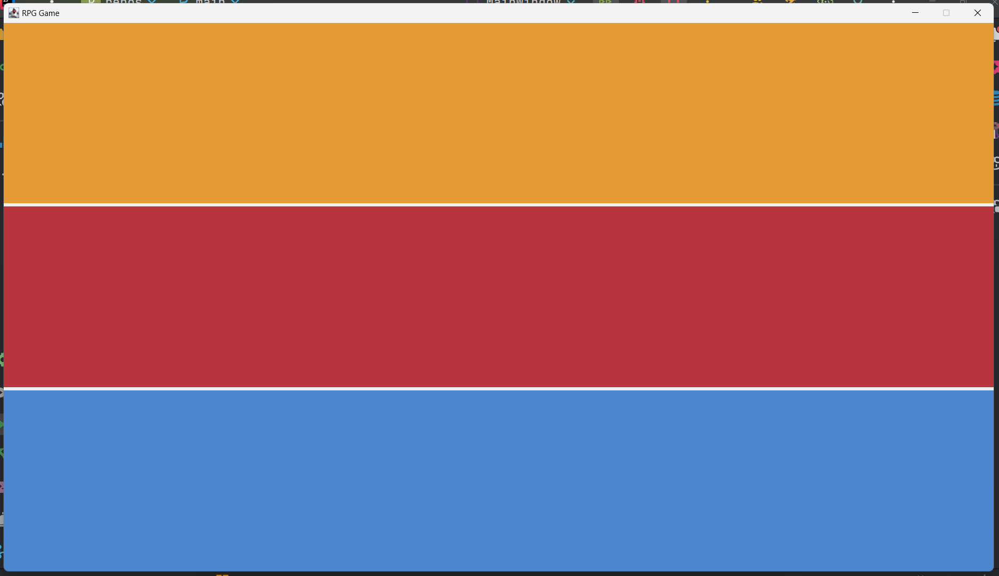

# 11. Secciones de iniciales de la ventana

Una vez que hemos creado dividamos la ventana en tres secciones:

* **Barra de Estado**: En la parte superior de la ventana, se mostrará información relevante sobre el estado del juego,
  como la salud del jugador, el nivel actual, etc.
* **Panel de Juego**: En el centro de la ventana, se mostrará el área de juego donde se representarán los elementos
  visuales del juego, como el jugador, los enemigos, la vida del enemigo, etc.
* **Barra de Acción**: En la parte inferior de la ventana, se mostrarán los botones de acción que el jugador puede
  utilizar para interactuar con el juego, como atacar, defender, usar objetos, etc. Además del área de texto donde se
  mostrarán mensajes al jugador.

Para dividir la ventana tomaremos tres paneles y los agregaremos al panel principal de la ventana. Cada panel se
personalizará con un color de fondo diferente para distinguir claramente las secciones.

Para que quede claro, aquí está el diseño de la ventana con las secciones:


 {style="block"}

A continuación, se muestra un ejemplo de cómo dividir la ventana en secciones utilizando paneles:

```java
package rpg.gui;

import javax.swing.*;

public class MainWindow extends JFrame {
    private JPanel mainPanel;

    public MainWindow() {

        setTitle("RPG Game");
        setSize(WindowConstants.WINDOW_SIZE);
        setDefaultCloseOperation(JFrame.EXIT_ON_CLOSE);
        setLocationRelativeTo(null);
        setContentPane(mainPanel);
        setVisible(true);
        setResizable(false);
    }

    public static void main(String[] args) {
        new MainWindow();
    }
}
```

## Entregable

Como evidencia de la implementación de las secciones de la ventana, crea un archivo de captura de pantalla que muestre
la ventana de la aplicación con las secciones claramente visibles. Asegúrate de que cada sección tenga un color de fondo
diferente para distinguirlas.

Así mismo haz que cada una de las secciones sean de tamaños diferentes, por ejemplo:

* **Barra de Estado**: 150 píxeles de altura.
* **Panel de Juego**: 370 píxeles de altura.
* **Barra de Acción**: 340 píxeles de altura.

Guarda el archivo de captura de pantalla como `window_sections.png` en la carpeta `images` de tu proyecto.